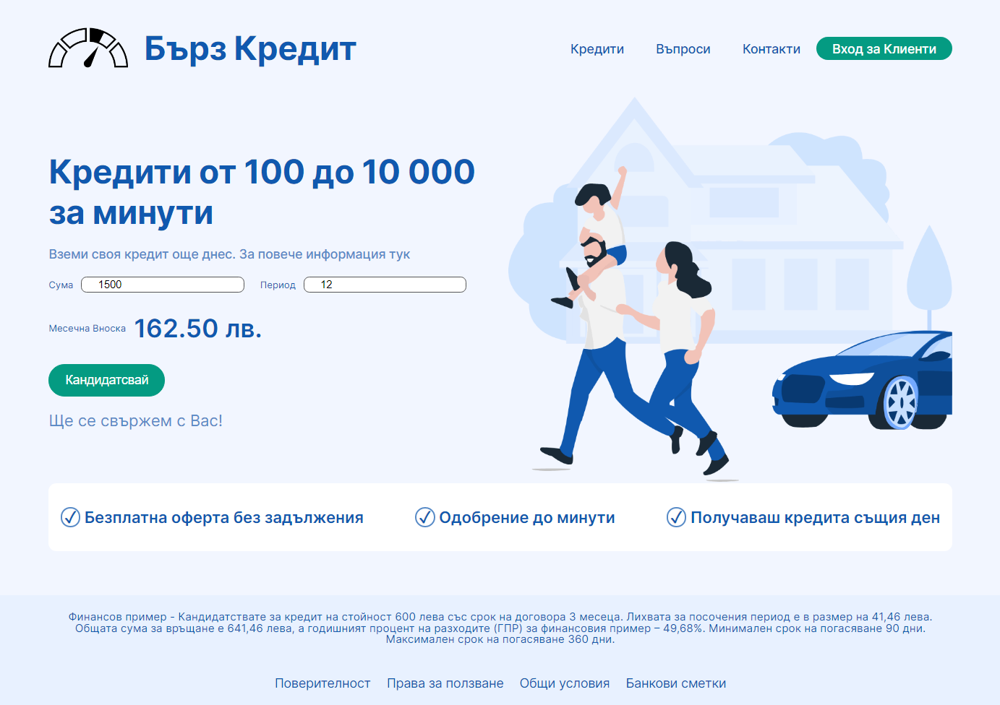

# Fast Loan

Small app, credit score. First try on NestJs + Angular

## Development server
  # Client
  Run `ng serve` for a dev server. Navigate to `http://localhost:4200/`. The app will automatically reload if you change any of the source files.
  # Server
  # watch mode
  Run `npm run start:dev` for a API server. Navigate to `http://localhost:3000/`
  

## Installation

```bash
$ npm install
```

## Fast Loan Screenshot
<div align ="center">

</div>


